# InfinitePro

输出文件夹结构文件命令：`tree /F /A > structure.txt`

## 一、项目端口号

### 1.1号段规划

| 端口段               | 服务类型         | 说明 / 使用范围                                                 |
|-------------------|--------------|-----------------------------------------------------------|
| **20000 - 20999** | 预留/临时端口      | 可用于临时测试、开发调试，避免与正式服务冲突                                    |
| **21000 - 21999** | 业务子服务端口      | 每个微服务（如 patent-service、user-service、auth-service 等）使用不同端口 |
| **22000 - 22999** | 基础服务端口       | 框架/支撑服务，如 Gateway、Config/Nacos 客户端、服务发现相关                 |
| **23000 - 23999** | 运维与监控端口      | 如 Spring Boot Admin、Prometheus、Grafana、日志/审计服务            |
| **24000 - 24999** | 分布式追踪 / 链路监控 | Zipkin、SkyWalking、Jaeger 等                                |
| **25000 - 25999** | 数据库或中间件本地调试  | 本地 MySQL、Redis、RabbitMQ 等（非生产端口）                          |
| **26000 - 29999** | 备用 / 未来扩展    | 为未来新增微服务或辅助工具保留，避免修改已有端口                                  |

### 1.2已占用端口
| 端口    | 对应服务       |
|-------|------------|
| 22000 | nacos核心服务  |
| 22001 | nacos控制台   |
| 22010 | gateway子服务 |
| 21010 | 登录鉴权子服务    |
| 29999 | 前端启动端口     |
| 3306  | MySQL      |

## 二、前端项目启动

### 2.1 项目包
- 项目名：_InfinitePro_front
- 已选包：Router、Pinia、ESLint、Prettier、TypeScript

```mermaid
flowchart TD
    subgraph Microservices[微服务架构]
        GW[网关服务 Gateway]
        Auth[鉴权微服务 Auth-Service]
    end

    subgraph Common[common 模块（已完成）]
        Base[BaseDTO / BaseIdDTO / BaseIdEntity]
        ApiRes[ApiResult 返回类]
        Enum[CodeEnum / StatusEnum]
        GlobalEx[GlobalException / GlobalExceptionHandler]
        Jackson[JacksonConfig 序列化/反序列化]
    end

    subgraph ConfigCenter[Nacos 配置中心]
        Nacos[Nacos 配置]
    end

    subgraph Completed[已完成功能]
        CORS[跨域配置 GatewayCorsConfig]
    end

    subgraph ToDo[待开发全局功能]
        Interceptor[全局拦截器/过滤器\n（日志/鉴权/限流）]
        Constant[全局常量类\n（状态码/配置常量）]
        Aspect[全局切面\n（日志/性能/异常处理）]
    end

    %% 服务与 common 依赖
    GW --> Base
    GW --> ApiRes
    GW --> Enum
    GW --> GlobalEx
    GW --> Jackson
    Auth --> Base
    Auth --> ApiRes
    Auth --> Enum
    Auth --> GlobalEx
    Auth --> Jackson

    %% 服务与 Nacos 关系
    GW --> Nacos
    Auth --> Nacos

    %% 已完成功能
    GW --> CORS

    %% 待开发模块关系
    GW --> Interceptor
    Auth --> Interceptor
    GW --> Constant
    Auth --> Constant
    GW --> Aspect
    Auth --> Aspect

    %% 可选标注
    style Completed fill:#c8f7c5,stroke:#2e7d32,stroke-width:2px
    style ToDo fill:#f9f2c2,stroke:#d68910,stroke-width:2px
    style Common fill:#d0e1f9,stroke:#2176bd,stroke-width:2px
    style ConfigCenter fill:#f0d0d0,stroke:#b22222,stroke-width:2px

```

